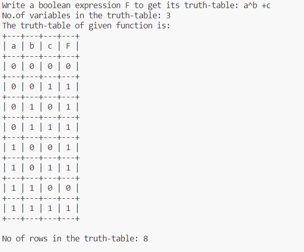

# Truth Table Generator

Program to draw truth-table for a given boolean expression. In addition, it also provides number of boolean variables present in the expression and number of rows in the truth table. The time complexity is exponential in nature.


## Working
It parses the expression, and converts the expression(**infix**) to **postfix** expression. After this, it evaluates postfix expression for all possible bit values of boolean variables.

Example:

*Infix expression* :    a^b + c

*Postfix expression* :  ab^c+

### Example
Boolean Expression F = ``` a^b + c ```



## Supported Boolean Operators

- NOT
- OR
- AND
- XOR
- NAND
- NOR
- XNOR

### Precedence Order from top to bottom
|Precedence Order |
|    :---    |     
|   PARENTHESIS |
|   NOT |
|   AND  |
|   XOR  |
|   OR  |

### Associativity 
Left to right associativity

## Usage

*To compile the program*
> 
    g++ .\main.cpp -o run

*To run the program*
>
    .\run.exe